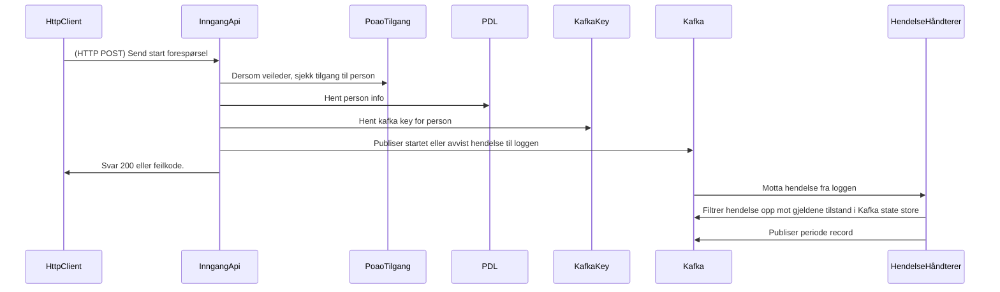

# paw-arbeidssokerregisteret-api
1. [Hvordan fungerer det](#hvordan-fungerer-det)
2. [Kafka topics](#kafka-topics)
   1. [Periode topic](#periode-topic)
   2. [Opplysninger om arbeidssøker topic](#opplysninger-om-arbeidssoker-topic)
   3. [Profilerings topic](#profilerngs-topic)
   4. [Arena topic](#arena-topic)
3. REST API
   1. [Søke API (internt for NAV)](https://github.com/navikt/paw-arbeidssokerregisteret-api-soek)
   2. [Eksternt API](https://github.com/navikt/paw-arbeidssokerregisteret-eksternt-api)
   3. [Start/Stopp av Perioder](https://github.com/navikt/paw-arbeidssokerregisteret-api-inngang)
  
## Hvordan Fungerer Det
Arbeidssøkerregisteret er basert på arbeidssøkerperioder. En periode har alltid en start dato og får en avsluttnings dato så snart den avsluttes. En person kan ha 0 eller 1 aktive perioder til en hver tid.

I tillegg til perioden inneholder også registeret en del opplysninger om arbeidssøkeren samt resultatet av profilering av arbeidssøkeren. 
Profileringen gjøres på bakgrunn av opplysningene og brukes som besluttningsstøtte i veileders vurderingen av brukerens oppfølgisbehov. 
Innesendig av opplysninger er valgfritt og det er derfor ikke gitt at vi har opplysninger om en gitt person. 
Har vi ikke opplsyninger har vi heller ikke noe profileringsresultat.

Informasjonen i registeret kan hentes enten ved å abonnere på de aktuelle Kafka topicene eller bruke oppslag API.

Enkel oversikt over hva som skjer når når en periode startes via API:


## Kafka Topics
Viktige punkter angående Kafka topics:
* Tilgang til topics er styrt av ACL. Den foretrukne måten å be om tilgang på er via PR til paw-iac. Her finner man config for de aktuelle topicene. Skirvetilgang til repoet er begrenset så worflowen blir 'fork' + 'PR'. Husk å inkludere relevant info for tilgang (link til behandlingskatalog) i PR.
* Alle topics er co-partitioned, dvs likt antall partisjoner og for en gitt person vil alle records ha samme key på tvers av alle topics.
* Nøkkelen(Record Key) er ikke unik per bruker, men samme bruker vil alltid få samme nøkkel.

Dette betyr blant annet at man kan lage enkle egne Kafka Streams joins operasjoner på PeriodeId uten å måtte repartisjonere. Alt som skal til er en enkel KeyValue store med [TopicJoin](`helpers/topics_join-v4.avdl`).

Registeret består av 3 kafka topics. Meldingsformatet er Avro og skjema er tilgjengelig i dette repoet, blant annet som [maven artifacter](https://github.com/navikt/paw-arbeidssokerregisteret-api/releases).
For kotlin/java prosjekter kan man enkelt generere nødvendige klasser via et gradle plugin. Eksempel fra build.gradle.kts i [Hendelse håndtering](https://github.com/navikt/paw-arbeidssokerregisteret-event-prosessor):
```kotlin
import com.github.davidmc24.gradle.plugin.avro.GenerateAvroProtocolTask

plugins {
    kotlin("jvm")
    id("com.github.davidmc24.gradle.plugin.avro") version "1.9.1"    
}

val arbeidssokerregisteretSchemaVersion = "1.7843506781.4-1"

val schema by configurations.creating {
  isTransitive = false
}

dependencies {
    schema("no.nav.paw.arbeidssokerregisteret.api:main-avro-schema:$arbeidssokerregisteretSchemaVersion")
    implementation("org.apache.avro:avro:1.11.0")
}

tasks.named("generateAvroProtocol", GenerateAvroProtocolTask::class.java) {
  schema.forEach {
    source(zipTree(it))
  }
}
```

 

### Versjonering
Avro schema og topics er versjonert. Ved endringer som ikke er bakoverkompatible vil følgende gjøres:
* De aktuelle delen i schema endres fra -v(x) til -v(x+1), feks periode-v1.avdl til periode-v2.avdl (samme edring gjøres også for namespace i avro filen)
* Major version på schema atrifactet økes med 1, feks fra 1.123.2-1 til 2.123.5-1.
* Berørte topics for en ny versjon, feks paw.arbeidssokerperioder-v1 blir til paw.arbeidssokerperioder-v2
* Gamle topics går over i vedlikeholdsmodus, dvs nye data blir publisert, men det blir ingen oppdateringer av selve schemaet og ingen nye applikasjoner legges til i ACL. 
* Nye topics spoles opp og vil inneholde alt av data, record key, Periode.id og OpplysningerOmArbeidssoeker.id, vil forbli uendret i ny topic. Så dersom en periode-v1 har samme id som en periode-v2 er det den samme perioden. 

Hvor lenge topics blir gående i vedlikeholds modus er ikke helt avgjort. I enkelte tilfeller vil eksterne endringer gjøre at det i praksis ikke blir mulig å vedlikeholde eldre topics. Feks dersom data som var obligatorisk ikke lenger er tilgjengelig eller ikke lenger er lov å samle inn.

Konsumenter som skal bytte til en ny topic versjon må håndtere dette på en måte. Her er det flere muligheter, feks brukte periode.id og opplysningerOmArbeidssoeker.id for å holde orden på hva som alt er håndtert. Det er også mulig å lage høyvannsmerker basert på record.key, record.timestamp og topic. Timestamp settes når vi godtar en ekstern forespørsel, så en slik løsning vil måtte leve med den teoretiske muligheten for at en ny melding kan være eldre enn forrige melding fra samme topic med samme key. Å bruke offset er trolig den minst trygge måten å gjøre det på siden den nye versjonen kanskje inneholde fære eller flere meldinger enn den forrige versjonen av topicet. Feks ved endringer i hva som er gyldig/ikke gyldig data.

### Periode Topic
Topic navn: `paw.arbeidssokerperioder-{VERSION}`  
Gjeldene versjon: `beta-v7`  
Schema: [periode](main-avro-schema/src/main/resources/periode-v1.avdl)

* Innholder samtlige arbeidssøker perioder.
* Alle perioder har en start dato.
* Når de avsluttes settes tidspunkt for avslutning. Dette tidspunktet vil aldri være frem i tid.
* Identitesnummeret kan endre seg, det vil da komme en ny record hvor identitetsnummeret er endret.
* Record timestamp matcher tidspunktet vi godtok 'start' forespørselen.

### Opplysninger Om Arbeidssoker Topic
Topic navn: `paw.opplysninger-om-arbeidssoeker-{VERSION}`  
Gjeldene versjon: `beta-v7"`  
Schema: [opplysninger_om_arbeidssoker](main-avro-schema/src/main/resources/opplysninger_om_arbeidssoeker-v3.avdl)

Inneholder opplysninger om arbeidssøkeren. Opplysningene er knyttet til en periode og en periode kan ha flere records med opplysninger knyttet til seg. I enkelte tilfeller vil systemet gjenbruke opplysninger når følgende hendelser inntreffer iløpet av 60 sekunder:
1. Opplysninger sendes in for den aktive perioden (referert til som A)
2. Perioden A avsluttes.
3. En ny periode (B) startes.

I slike tilfeller vil man først se at opplysningene som publiseres er knyttet til periode A, også kort tid etterpå publiseres opplysningene på nytt (med samme opplysnings id), men denne gangen knyttet til periode B.  
Endringer av opplysninger vil alltid føre til en ny record med ny opplysnings id.   
Record timestamp matcher tidspunktet vi mottok opplysningene.


### Profilerngs Topic
Topic navn: `paw.arbeidssoker-profilering-{VERSION}`  
Gjeldene versjon: `beta-v1`  
Schema: [periode](main-avro-schema/src/main/resources/profilering-v1.avdl)

Inneholder resultatet av profileringen som gjøres når det sendes inn opplysninger.  
En profilering vil alltid være knyttet til en opplysnings id og dermed også en periode id.
Record timestamp matcher i praksis record timestamp for opplysningene, men kan i noen tilfeller(migrert data) matche record timestamp for perioden.  
Profilering.sendtInnAv.tidspunkt kan benyttes for å se når selve profilering ble utført. Så i praksis viser Record timestamp når profileringen ideelt sett gjelder fra, mens '....tidspunkt' viser når den ble utført. 

### Arena Topic
Topic navn: `paw.arbeidssoker-arena-{VERSION}`
Gjeldene versjon: `beta-v1`
Schema: [arena](arena-avro-schema/src/main/resources/arena-v3.avdl)

Topic utelukkende for Arena. Endringer kan forkomme uten forvarsel basert på interne diskusjoner med Arena utviklere og topic blir slettet så snart Arena ikke lenger har behov for det.  
`arena-avro-schema/src/main/resources/` inneholder en enkelt fil med en record. `avdl` filene som importeres opprettes som en del av byggeprosessen (de er basert på innholdet i main-avro-schema).
