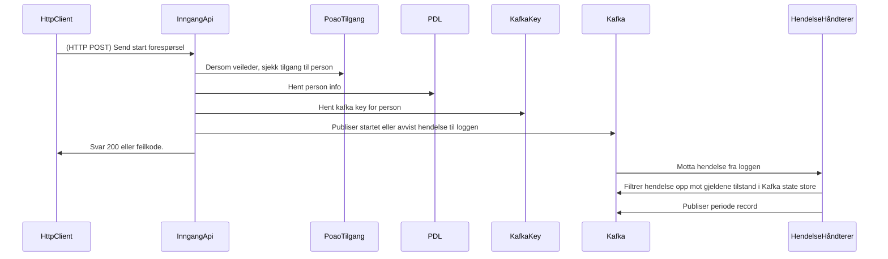

# paw-arbeidssokerregisteret-api
1. [Hvordan fungerer det](#hvordan-fungerer-det)
2. [Kafka topics](#kafka-topics)
   2. [Periode topic](#periode-topic)
   3. [Opplysninger om arbeidssøker topic](#opplysninger-om-arbeidssoker-topic)
   4. [Profilerings topic](#profilerngs-topic)
3. REST API
  1. [Søke API (internt for NAV)](https://github.com/navikt/paw-arbeidssokerregisteret-api-soek)
  2. [Eksternt API](https://github.com/navikt/paw-arbeidssokerregisteret-eksternt-api)
  3. [Start/Stopp av Perioder](https://github.com/navikt/paw-arbeidssokerregisteret-api-inngang)
  
## Hvordan Fungerer Det
Arbeidssøkerregisteret er basert på arbeidssøkerperioder. En periode har alltid en start dato og får en avsluttnings dato så snart den avsluttes. En person kan 0 eller 1 aktive perioder til en hver tid.

I tillegg til perioden inneholder også registeret en del opplysninger om arbeidssøkeren samt resultatet av profilering av arbeidssøkeren. Profileringen gjøre på bakgrunn av opplysningene og brukes til å gi brukeren behovs tilpasset oppføling. Innesendig av opplysninger er valgfritt og det er derfor ikke gitt at vi har opplysninger om en gitt person. Har vi ikke opplsyninger har vi heller ikke noe profileringsresultat.

Informasjonen i registeret kan hentes enten ved å abonnere på de aktuelle Kafka topicene eller bruke søke API.

Enkel oversikt over hva som skjer når når en periode startes via API:


## Kafka Topics
Registeret består av 3 kafka topics. Meldingsformatet er Avro og skjema er tilgjengelig i dette repoet, blant annet som [maven artifacter](https://github.com/navikt/paw-arbeidssokerregisteret-api/packages/2061047).
For kotlin/java prosjekter kan man enkelt generere nødvendige klasser via et gradle plugin. Eksempel fra build.gradle.kts i [Hendelse håndtering](https://github.com/navikt/paw-arbeidssokerregisteret-event-prosessor):
```kotlin
import com.github.davidmc24.gradle.plugin.avro.GenerateAvroProtocolTask

plugins {
    kotlin("jvm")
    id("com.github.davidmc24.gradle.plugin.avro") version "1.9.1"    
}

val arbeidssokerregisteretSchemaVersion = "1.7843506781.4-1"

val schema by configurations.creating {
  isTransitive = false
}

dependencies {
    schema("no.nav.paw.arbeidssokerregisteret.api:main-avro-schema:$arbeidssokerregisteretSchemaVersion")
    implementation("org.apache.avro:avro:1.11.0")
}

tasks.named("generateAvroProtocol", GenerateAvroProtocolTask::class.java) {
  schema.forEach {
    source(zipTree(it))
  }
}
```

Samtlige topics er co-partitioned, dvs likt antall partisjoner og for en gitt person vil alle records ha samme key på tvers av alle topics.

### Periode Topic
Topic navn: `paw.arbeidssokerperioder-{VERSION}`  
Gjeldene versjon: `beta-v7`  
Schema: [periode](main-avro-schema/src/main/resources/periode-v1.avdl)

Innholder samtlige arbeidssøker perioder. Alle perioder har en start dato. Når de avsluttes settes tidspunkt for avslutning. Dette tidspunktet vil aldri være frem i tid. 

### Opplysninger Om Arbeidssoker Topic
Topic navn: `paw.opplysninger-om-arbeidssoeker-{VERSION}`  
Gjeldene versjon: `beta-v7"`  
Schema: [opplysninger_om_arbeidssoker](main-avro-schema/src/main/resources/opplysninger_om_arbeidssoeker-v3.avdl)

Inneholder opplysninger om arbeidssøkeren. Opplysningene er knyttet til en periode og en periode kan ha flere records med opplysninger knyttet til seg. I enkelte tilfeller vil systemet gjenbruke opplysninger når følgende hendelser inntreffer iløpet av 60 sekunder:
1. Opplysninger sendes in for den aktive perioden (referert til som A)
2. Perioden A avsluttes.
3. En ny periode (B) startes.

I slike tilfeller vil man først se at opplysningene som publiseres er knyttet til periode A, også kort tid etterpå publiseres opplysningene på nytt (med samme opplysnings id), men denne gangen knyttet til periode B.

### Profilerngs Topic
Topic navn: `paw.arbeidssoker-profilering-{VERSION}`  
Gjeldene versjon: `beta-v1`  
Schema: [periode](main-avro-schema/src/main/resources/profilering-v1.avdl)

Inneholder resultatet av profileringen som gjøres når det sendes inn opplysninger. En profilering vil alltid være knyttet til en opplysnings id og dermed også en periode id.