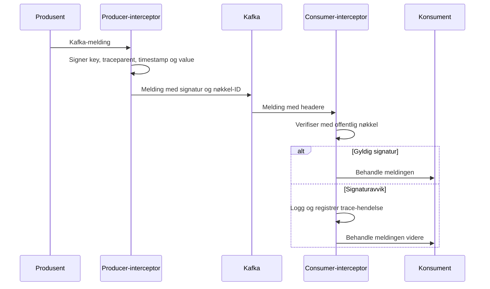

# Signering av Kafka-meldinger

Arbeidssøkerregisteret signerer utvalgte Kafka-meldinger. Signaturen avdekker meldinger som er endret etter publisering eller publisert uten en godkjent signeringsnøkkel. Signeringen supplerer Kafka-autentisering og ACL-er.

> **Nåværende håndtering er detekterende, ikke avvisende.** Manglende eller ugyldig signatur og ukjent nøkkel-ID logges, men meldingen behandles videre. Signeringen hindrer derfor ikke alene at en falsk melding påvirker systemet.

## Slik virker løsningen

De to monorepoene har hvert sitt `kafka-signing`-bibliotek. Bibliotekene bruker samme format:

1. En producer-interceptor serialiserer Kafka-nøkkelen og meldingsverdien og signerer dem med ECDSA P-256 og SHA-256.
2. Signaturen og nøkkel-ID-en legges i headerne `x-paw-signature` og `x-paw-signing-key-id`.
3. En consumer-interceptor finner riktig offentlig nøkkel og kontrollerer signaturen.
4. Valideringen registreres i tracing. Avvik logges med merket `[kafka-signing]`.

Signaturen dekker disse serialiserte dataene i fast rekkefølge og med lengdeprefiks:

```text
key | traceparent | timestamp | value
```

Topic, partisjon, offset og andre headere er ikke signert. Produsenten setter tidsstempelet før signering, slik at Kafka lagrer det samme tidsstempelet som inngår i signaturen.



Sentrale transformasjonssteg fjerner gamle signeringsheadere før den nye meldingen signeres. Signaturen viser dermed det siste godkjente produsentleddet, ikke hele kjeden tilbake til den opprinnelige produsenten.

## Signerte topics og produsenter

Tabellen viser oppsettet i produksjon 21. august 2026. Den dekker topics som brukes direkte i topologiene. Interne Kafka Streams-topics er ikke kartlagt.

| Topic | Applikasjoner som skriver signert | Applikasjoner som verifiserer |
|---|---|---|
| `paw.arbeidssoker-hendelseslogg-v1` | `api-start-stopp-perioder`, `bekreftelse-utgang` | `hendelseprosessor` |
| `paw.arbeidssokerperioder-v1` | `hendelseprosessor` | `bekreftelse-tjeneste`, `bekreftelse-utgang`, `profilering`, `oppslag-api-v2` |
| `paw.opplysninger-om-arbeidssoeker-v1` | `hendelseprosessor` | `profilering`, `oppslag-api-v2` |
| `paw.arbeidssoker-profilering-v1` | `profilering` | `oppslag-api-v2` |
| `paw.arbeidssoeker-profilering-grunnlag-v1` | `profilering` | Ingen verifiserende konsument funnet |
| `paw.arbeidssoker-bekreftelse-v1` | `bekreftelse-api`, `bekreftelse-hendelsefilter` | `bekreftelse-tjeneste`, `oppslag-api-v2` |
| `paw.arbeidssoker-bekreftelse-paavegneav-v2` | `bekreftelse-hendelsefilter` | `bekreftelse-tjeneste`, `oppslag-api-v2` |
| `paw.arbeidssoker-bekreftelse-hendelseslogg-v2` | `bekreftelse-tjeneste` | `bekreftelse-utgang` |
| `paw.arbeidssoeker-egenvurdering-v1` | `egenvurdering-api` | `oppslag-api-v2` |

`bekreftelse-hendelsefilter` leser bekreftelser fra topics som tilhører andre team, og republiserer dem med PAW-signatur. Signaturen bekrefter at filteret publiserte meldingen videre, men ikke hvem som skrev originalen.

Andre konsumenter må selv aktivere valideringsinterceptoren eller kontrollere signaturen på annen måte.

## Nøkler og tillitsmodell

Hver signerende applikasjon har et eget nøkkelpar:

- Den private nøkkelen og nøkkel-ID-en monteres som en Nais-secret i produsentens pod.
- Offentlige nøkler ligger som classpath-ressurser i `kafka-signing`-biblioteket.
- Konsumentene bruker `x-paw-signing-key-id` til å velge offentlig nøkkel.

Nye offentlige nøkler må distribueres til konsumentene før produsenten tar dem i bruk. De private nøklene ligger i Nais-secrets i Team Paws namespace. Bare personer og arbeidslaster med tilgang til disse kan hente nøklene. En kompromittert Kafka-administratorkonto kan derfor publisere en melding, men ikke lage en gyldig signatur. Personer med tilgang til Team Paws secrets har allerede omfattende tilgang og inngår i tillitsgrensen for løsningen.

## Avvik og overvåking

Valideringen oppdager og logger:

- manglende signatur eller nøkkel-ID
- nøkkel-ID som ikke finnes i konsumentens nøkkelregister
- signatur som ikke stemmer med Kafka-nøkkel, `traceparent`, tidsstempel og meldingsverdi
- tekniske feil under valideringen

Ved signeringsfeil logger produsenten feilen og sender meldingen uten signatur. Både produsenten og konsumenten lar meldingen gå videre ved feil (fail-open). `[kafka-signing]`-meldingene må overvåkes for at kontrollen skal virke.

## Hva løsningen ikke gir

- **Konfidensialitet:** Meldingsinnholdet krypteres ikke.
- **Preventiv kontroll:** Meldinger med signaturavvik stoppes ikke i dagens løsning.
- **Beskyttelse ved stjålet signeringsnøkkel:** En angriper med den private nøkkelen kan lage gyldige signaturer.
- **Replay-beskyttelse:** En tidligere gyldig melding kan publiseres på nytt fordi topic, partisjon og offset ikke er signert. Replayen kan likevel skille seg ut: Det signerte tidsstempelet kan være eldre enn tidsstemplene til meldinger med lavere offset i samme topic-partisjon. `traceparent` er også signert og kan brukes til å oppdage avvik fra den opprinnelige meldingsflyten.
- **Full sporbarhet gjennom flere ledd:** Hvert produsentledd erstatter den forrige signaturen. En signert `traceparent` kan likevel knytte meldingene i de ulike leddene sammen. Det krever at `traceparent` videreføres gjennom hele flyten, og at meldingene sammenstilles.
- **Kontroll av faglig innhold:** En gyldig signatur viser hvilken nøkkel som signerte bestemte bytes, ikke at innholdet er riktig.

Signering erstatter derfor ikke Kafka-ACL-er, begrenset tilgang til secrets, logging, alarmer eller kontroll av duplikater og meldingsrekkefølge.

## Mulig kontrollapplikasjon

En kontrollapplikasjon kan abonnere på relevante topics og lagre meldingene slik de ble publisert. Ved å kombinere signaturer, tidsstempler og `traceparent` kan den følge en hendelse gjennom flere ledd.

Med domenekunnskap kan applikasjonen også vurdere årsak og virkning. Den kan vite hvilke meldinger en inngående hendelse normalt skal føre til, og dermed oppdage:

- forventede meldinger som mangler
- meldinger som ikke har en kjent årsak
- ugyldige tilstandsoverganger eller uventet rekkefølge
- duplikater og mulig replay
- brudd i en trace eller uventet lang behandlingstid
- meldinger som er signert av en annen applikasjon enn forventet

Kafka Streams-state trenger ikke være signert for å gjøre denne kontrollen. Når applikasjonen kjenner de inngående meldingene og det forventede resultatet, kan den kontrollere at de riktige meldingene kommer ut. Den interne tilstanden er da mindre viktig enn sammenhengen mellom inngående og utgående meldinger.

En slik kontroll utfyller dagens signaturvalidering. Signaturen viser om en kjent produsent signerte meldingen. Domenekunnskapen viser om meldingen hører hjemme i flyten.

## Implementasjonskilder

- [`paw-arbeidssoekerregisteret-monorepo-intern` ved `d2c046f`](https://github.com/navikt/paw-arbeidssoekerregisteret-monorepo-intern/tree/d2c046f1cb1fa715705f1a0eead1556451e244b9)
- [`paw-arbeidssoekerregisteret-monorepo-ekstern` ved `47ac10a`](https://github.com/navikt/paw-arbeidssoekerregisteret-monorepo-ekstern/tree/47ac10a5b71b82f225561541cf9d8a17100518a9)

Implementasjonen ligger i `lib/kafka-signing`. Oppsettet for hver applikasjon ligger under `apps/`.
