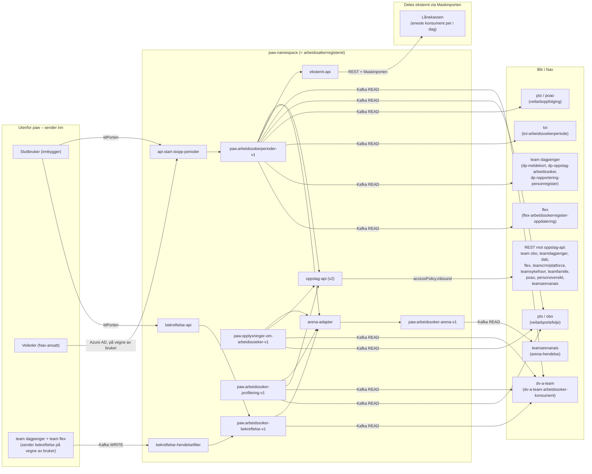

# Ytterpunkter: dataflyt inn og ut av paw-namespacet

Skissen viser hvor data kommer inn til arbeidssøkerregisteret utenfra, og hvor data forlater
paw-namespacet. Utgående data er delt i to: data som blir i Nav, og data som deles eksternt via
Maskinporten.

Kilder: [paw-iac](https://github.com/navikt/paw-iac) (Kafka-ACL-er), README og
[docs/meldingsautentisitet-og-integritet.md](meldingsautentisitet-og-integritet.md) i dette
repoet, samt kildekode i
[paw-arbeidssoekerregisteret-monorepo-intern](https://github.com/navikt/paw-arbeidssoekerregisteret-monorepo-intern)
og [paw-arbeidssoekerregisteret-monorepo-ekstern](https://github.com/navikt/paw-arbeidssoekerregisteret-monorepo-ekstern).

For Kafka-topics er reglen: ekstern READ-tilgang i ACL regnes som data ut, ekstern WRITE-tilgang
regnes som data inn. For REST-API-er er reglen tilsvarende: en `accessPolicy.inbound`-regel fra en
applikasjon utenfor paw-namespacet (annet `namespace` enn `paw`, eller uten namespace når kallende
app selv ligger i et annet namespace) regnes som data ut. Alle nais.yaml-filer under er hentet fra
`monorepo-intern` (commit `c41b654`) og `monorepo-ekstern` (commit `c00a502`).

I skissen er alt som ligger **innenfor den blå boksen** («paw-namespace») det som faktisk er
arbeidssøkerregisteret: applikasjonene og Kafka-topicene som paw-teamet selv eier og drifter.
Alt utenfor boksen, uansett om det er til venstre (sender inn) eller til høyre (mottar ut), er
andre team, systemer eller sluttbrukere, ikke en del av arbeidssøkerregisteret.

Nøyaktig hvilke applikasjoner som har tilgang, står i tabellene under.

## Inngangspunkter

| Kilde | Møtepunkt i paw | Mekanisme | Kilde/referanse |
|---|---|---|---|
| Sluttbruker (innbygger) | `api-start-stopp-perioder` | IdPorten (HTTP) | `apps/api-start-stopp-perioder`, monorepo-intern |
| Veileder (Nav-ansatt) | `api-start-stopp-perioder` | Azure AD, på vegne av bruker | `apps/tilgangskontroll/AuthProviders.kt`, monorepo-intern |
| Sluttbruker (innbygger) | `bekreftelse-api` | IdPorten | `apps/bekreftelse-api`, monorepo-intern |
| team dagpenger (`dp-rapportering-personregister`, `dp-meldekort`) | `paw.arbeidssoker-bekreftelse-paavegneav-teamdagpenger-v2` | Kafka, ekstern WRITE (readwrite-ACL) | `kafka/prod/bekreftelse/eksterne/*teamdagpenger-v2.yaml`, paw-iac |
| team flex (`flex-arbeidssokerregister-oppdatering`) | `paw.arbeidssoker-bekreftelse-paavegneav-friskmeldt-til-arbeidsformidling-v1` | Kafka, ekstern WRITE (readwrite-ACL) | `kafka/prod/bekreftelse/eksterne/*friskmeldt*.yaml`, paw-iac |

`bekreftelse-hendelsefilter` leser disse eksterne «på vegne av»-topicene og republiserer med
PAW-signatur til `paw.arbeidssoker-bekreftelse-v1` (se
[docs/meldingsautentisitet-og-integritet.md](meldingsautentisitet-og-integritet.md)).

`arena-adapter` leser fra `paw.arbeidssokerperioder-v1`, `paw.arbeidssoker-profilering-v1`,
`paw.opplysninger-om-arbeidssoeker-v1` og `paw.arbeidssoker-bekreftelse-v1` (alle med Kafka READ,
team paw), slår sammen (join) disse og skriver et beriket resultat til
`paw.arbeidssoker-arena-v1`. team teamarenanais (`arena-hendelse`) har Kafka READ på dette topicet
og henter dataene derfra.

## Utgangspunkter som blir i Nav

**Kafka:**

| Topic | Innhold (kort) | Avro-schema (dette repoet) |
|---|---|---|
| `paw.arbeidssokerperioder-v1` | Start- og sluttidspunkt for en arbeidssøkerperiode, med identitetsnummer og metadata om hvem som startet/avsluttet den | `main-avro-schema/src/main/resources/periode-v1.avdl` |
| `paw.opplysninger-om-arbeidssoeker-v1` | Opplysninger arbeidssøkeren har oppgitt: jobbsituasjon (obligatorisk), og valgfritt utdanning, helse og annet | `main-avro-schema/src/main/resources/opplysninger_om_arbeidssoeker-v4.avdl` |
| `paw.arbeidssoker-profilering-v1` | Profileringsresultat brukt til å rute arbeidssøkeren til riktig veiledningstjeneste (`profilertTil`, alder, om personen har jobbet sammenhengende 6 av siste 12 måneder) | `main-avro-schema/src/main/resources/profilering-v1.avdl` |
| `paw.arbeidssoker-bekreftelse-v1` | Bekreftelse fra bruker for en periode: om personen har jobbet i perioden og om vedkommende vil fortsette som arbeidssøker, med hvilken løsning som sendte den inn | `bekreftelsesmelding-schema/src/main/resources/bekreftelsesmelding-v1.avdl` |
| `paw.arbeidssoker-arena-v1` | Beriket sammenslåing av periode, profilering og opplysninger, pluss bekreftelsen hvis perioden ble avsluttet fordi brukeren svarte nei på fortsatt arbeidssøker. Kun til bruk for Arena | `arena-avro-schema/src/main/resources/arena-v8.avdl` |

**Konsumenter per topic:**

| Topic | Ekstern konsument | Tilgang | Kilde/referanse |
|---|---|---|---|
| `paw.arbeidssokerperioder-v1` | dv-a-team: `dv-a-team-arbeidssoker-konsument`; pto/obo: `veilarbportefolje`; pto/poao: `veilarboppfolging`; toi: `toi-arbeidssoekerperiode`; team dagpenger: `dp-meldekort`, `dp-oppslag-arbeidssoker`, `dp-rapportering-personregister`; flex: `flex-arbeidssokerregister-oppdatering` | Kafka READ | `kafka/prod/paw.arbeidssokerperioder-v1.yaml`, paw-iac |
| `paw.arbeidssoker-profilering-v1` | dv-a-team: `dv-a-team-arbeidssoker-konsument`; pto/obo: `veilarbportefolje` | Kafka READ | `kafka/prod/paw.arbeidssoker-profilering-v1.yaml`, paw-iac |
| `paw.opplysninger-om-arbeidssoeker-v1` | dv-a-team: `dv-a-team-arbeidssoker-konsument`; pto/obo: `veilarbportefolje` | Kafka READ | `kafka/prod/paw.opplysninger-om-arbeidssoeker-v1.yaml`, paw-iac |
| `paw.arbeidssoker-bekreftelse-v1` | dv-a-team: `dv-a-team-arbeidssoker-konsument` | Kafka READ | `kafka/prod/bekreftelse/paw.arbeidssoker-bekreftelse-v1.yaml`, paw-iac |
| `paw.arbeidssoker-arena-v1` | teamarenanais: `arena-hendelse` | Kafka READ | `kafka/prod/paw.arbeidssoker-arena-v1.yaml`, paw-iac |

`pto` og `poao` er trolig eldre/gjeldende navn på samme team, begge står i ACL-en for
`veilarboppfolging`. Det samme gjelder trolig `pto`/`obo` for `veilarbportefolje`. Listen er
gjengitt slik den står i kildene, uten å slå sammen team-navnene.

**REST (`oppslag-api-v2`)**: dette er hovedkanalen for intern datadeling i Nav, med mange
konsumenter. Alle er registrert som `accessPolicy.inbound`-regler i
`apps/oppslag-api-v2/nais/nais-prod.yaml` (monorepo-ekstern):

| Team (namespace) | Applikasjoner |
|---|---|
| `teamarenanais` | `arena` |
| `dab` | `ao-oppfolgingskontor`, `veilarbdirigent` |
| `flex` | `flex-arbeidssokerregister-oppdatering`, `sykepengesoknad-backend` |
| `obo` | `veilarbperson`, `veilarbportefolje`, `veilarbvedtaksstotte` |
| `teamdagpenger` | `dp-oppslag-arbeidssoker`, `dp-rapportering-personregister`, `dp-meldekortregister`, `dp-meldekort`, `dp-rapportering`, `dp-soknadsdialog`, `dp-mine-dagpenger-frontend`, `dp-brukerdialog-frontend` |
| `teamcrm` / `platforce` | `saas-proxy` (trolig Salesforce-integrasjon, f.eks. Nav Kontaktsenter) |
| `teamsykefravr` | `isfrisktilarbeid` |
| `teamfamilie` | `familie-ef-sak` |
| `poao` | `veilarboppfolging` |
| `personoversikt` | `modiapersonoversikt-api` |

**REST (`egenvurdering-dialog-tjeneste`)**: `obo`-teamets `veilarbvedtaksstotte` har
`accessPolicy.inbound`-tilgang (`apps/egenvurdering-dialog-tjeneste/nais/nais-prod.yaml`,
monorepo-ekstern). Dette henger sammen med `paw.beriket-14a-vedtak-v1`, som i dag ikke har noen
ekstern Kafka-READ-ACL. 14a-vedtaksdata når altså `obo`/`veilarbvedtaksstotte` via REST, ikke
Kafka.

Interne paw-apper som `paw-brukerstotte` og de ulike frontendene
(`arbeidssokerregistrering(-for-veileder)`, `arbeidssoekerregisteret-for-personbruker`,
`aia-backend`, `aia-min-side-ssr`) kaller også inn til `oppslag-api-v2`, `bekreftelse-api`,
`egenvurdering-api` og `mine-stillinger-api`, men disse ligger selv i `namespace: paw` og regnes
derfor ikke som data ut av namespacet.

## Utgangspunkt som deles eksternt via Maskinporten

| API | Endepunkt | Scope | Kilde/referanse |
|---|---|---|---|
| `eksternt-api` | `POST /api/v1/arbeidssoekerperioder` | `nav:arbeid:arbeidssokerregisteret.read` | `apps/eksternt-api`, monorepo-ekstern (`nais-prod.yaml`, `security_config.toml`, `PeriodeRoutes.kt`) |

`eksternt-api` har i praksis bare dette ene endepunktet. Konsumenten sender inn et identitetsnummer
(og valgfritt en fra-dato), og får tilbake arbeidssøkerperiodene for personen. Ingen andre
ressurser er eksponert.

**Kjent konsument:** Lånekassen er i dag den eneste eksterne virksomheten med tilgang via
Maskinporten, ikke en av flere. Maskinporten-tilganger registreres i Maskinportens eget
administrasjonsgrensesnitt, ikke i Nav-repoene, så opplysningen er ikke verifisert i kildekoden.
Den er lagt inn på bakgrunn av kjent informasjon.

## Åpne punkter / ikke bekreftet

* `saas-proxy` (`teamcrm`/`platforce`) sin bruk av oppslagsdataene er antatt, ikke bekreftet mot
  dokumentasjon utenfor nais.yaml.
* Frontend-repoer (f.eks. bruker-vendt UI) er ikke gjennomgått i detalj. Inngangspunktet er
  identifisert via IdPorten-oppsettet i `api-start-stopp-perioder` og `bekreftelse-api`, og via
  `accessPolicy.inbound` i konsumerende API-er, ikke via selve frontend-koden.
